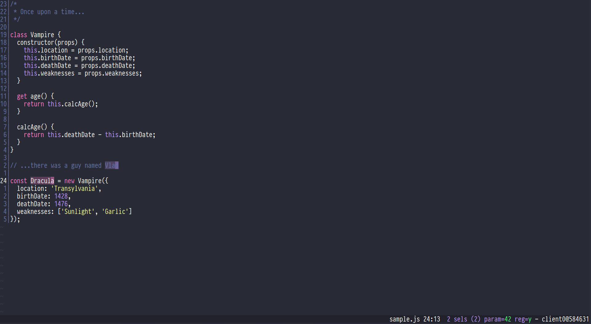

# [Dracula] for [Kakoune]

[dracula]: https://draculatheme.com
[kakoune]: https://kakoune.org

> A dark theme for [Kakoune].

## Install

All instructions can be found at [draculatheme.com/kakoune].

[draculatheme.com/kakoune]: https://draculatheme.com/kakoune

## Team

This theme is maintained by the following person(s) and a bunch of [awesome contributors][contributors].

[contributors]: https://github.com/dracula/kakoune/graphs/contributors

| [![alexherbo2’s avatar]][alexherbo2] |
| :----------------------------------: |
|             [alexherbo2]             |

[alexherbo2]: https://github.com/alexherbo2
[alexherbo2’s avatar]: https://github.com/alexherbo2.png?size=100

## Community

- [Twitter](https://twitter.com/draculatheme) - Best for getting updates about themes and new stuff.
- [GitHub](https://github.com/dracula/dracula-theme/discussions) - Best for asking questions and discussing issues.
- [Discord](https://draculatheme.com/discord-invite) - Best for hanging out with the community.

## License

[MIT License](./LICENSE)
